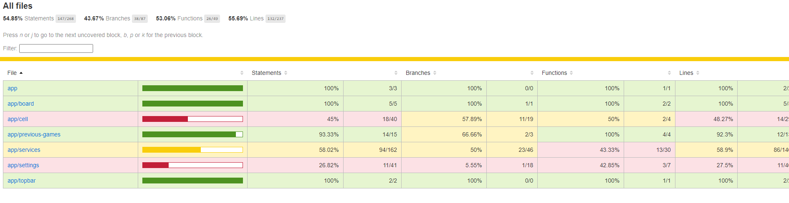

# Minesweeper Angular

An implementation of the Minesweeper game built using Angular 16.

The idea is to make it look and feel like the gameplay from Windows 98 with added options for multiplayer games and storing games and ranks.

---

[**🕹️PLAY THE GAME🕹️**](https://wfpena.github.io/)

---

 

 
 

## About the project

### **Design and Technologies:**

* `SASS` for styling.
* ``Karma`` and ``Jasmine`` used for the **unit tests** implementation and **code coverage reports**
* ``Webpack`` is used for the build. Using [@angular-builders/custom-webpack](https://www.npmjs.com/package/@angular-builders/custom-webpack) to overwrite the Angular build defaults.

> There are two options for webpack config. `webpack.dev.config.ts` (Development)  and `webpack.config.ts` (Production).
* ``ESLint`` is used as linter
* ``Yarn`` is used as default package manager

 

### **Features:**

* Regular Minesweeper gameplay. Adding flags, timer, bomb count, etc.

* Multiplayer support. Currently hardcoded for a max o 4 players but its easily changeable on the code.

* Save / Loading of previous games

* Difficulty levels (easy, medium and hard). With the addition of `custom` level for the player to choose the size of the board and amount of bombs.

---

## Running Locally

1. Install dependencies using `yarn install`
2. Run dev server using the command (it will start by default on port 4200 `http://localhost:4200/`):
> yarn start

 

---

 

## Unit tests

1. Run the command `yarn test`
2. You should see the results of the test and Karma will open a browser with the results

 

---

 

## Coverage Report

1. Run `yarn test:report`
2. The results will be shown on the console and the report will be generated on `./coverage/minesweeper-angular/`. <i>You can open the `index.html` file on that folder to see the results</i>

 

---

 

## Build

* **Production Build**:

Run `yarn build` to make the production build. The output path will be on the folder `dist\minesweeper-angular`.
> NOTE: The build setup can be overwritten using webpack by modifying the `webpack.config.ts` file.

* **Development Build**

You can run `yarn watch` to make a development build and watch for code changes.

You can also run `yarn build:dev` to make the development build.

> NOTE: To customize the dev build you can modify the `webpack.dev.config.ts` file.

---

 

## Linter

Run `yarn lint` to run the linter.

 

 

*You can change the lint specs on the `./.eslintrc.json` file.*

 

TODOS:

* Improve styling, the styles are very convuluted currently.
* Improve multiplayer support to add possibility of adding the names of the players.